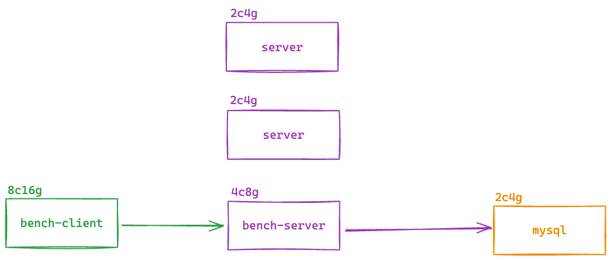

# 时序数据存储系统性能优化综合题

## 项目背景

你加入了一家全球工业物联网公司，负责优化其时序数据存储系统。该系统需要处理来自全球3000个工厂的实时传感器数据：

- 每个工厂有 20-50 种不同类型的传感器，每个工厂的负载和数据量不同
- 采样频率从 1 秒到 60 秒不等（存在±10%误差）
- 每种传感器数据根据采样频率有独立的传输延迟范围（如 50-200 ms）
- 传感器分高/中/低三级优先级，高优先级需更低尾部延迟
- 采用 push 模式：传感器通过 HTTP POST 将数据推送到存储系统

## 业务约束条件

1. **可靠性要求**：系统对失败率有上限要求（≤ 0.1%），数据不能丢失，系统崩溃后必须能够恢复
2. **性能要求**：P95 响应时间 ≤ 200ms，数据延迟不能超过5分钟
3. **成本控制**：硬件预算有限，不能简单通过升级硬件解决
4. **兼容性**：需要兼容现有的数据分析工具链
5. **监管要求**：部分数据需要满足审计合规，要求有完整的写入日志

## 服务环境介绍


### 硬件环境配置
1. 一台 2c4g 的服务器用于部署 Mysql；
2. 一台 4c8g 的服务器用于部署 bench-server；
3. 两台 2c4g 的服务器备用，可以随意使用；
4. 一台 8c16g 的服务器用于做压测 bench-client；

### 软件环境
- **操作系统**: Linux Ubuntu 20.04 LTS
- **编程语言**: Go 1.21+
- **数据库**: MySQL 8.0+
- **容器化**: Docker & Docker Compose
- **压测工具**: wrk, hey, artillery, k6

### 当前系统架构
- **HTTP服务器**: 基于Go语言的HTTP API服务
- **数据存储**: MySQL数据库，包含时序数据表和设备状态表
- **数据传输**: JSON格式的HTTP POST请求
- **负载均衡**: 单实例部署（需要优化）

### 当前性能指标(待测试)
分不同请求分别得出以下指标
- **QPS**: 约 1000 QPS（目标：10000+ QPS）
- **P99 Delay**: 约167MB/min，SSD写入带宽利用率仅5.3%
- **请求失败率**: 写入期间约15%

### 数据特征分析
- **平均记录大小**: 约85字节（基础数据）+ 可变负载数据（512B-20KB）
- **时间戳重复率**: 60%（多个传感器同时采样）
- **设备ID模式**: 每个工厂的设备ID具有相同前缀
- **数值精度**: 大部分传感器只需要2位小数精度
- **数据到达模式**: 存在明显的时间聚集性

## 系统API接口

### 核心API端点
- `POST /api/sensor-data` - 单条传感器数据上报
- `POST /api/sensor-rw` - 传感器数据读写操作（带事务）
- `POST /api/batch-sensor-rw` - 批量传感器数据读写操作
- `GET /api/stats` - 系统统计信息
- `GET /api/get-sensor-data` - 传感器时序数据查询
- `GET /health` - 健康检查

### 数据结构
- **传感器数据**: 包含时间戳、设备ID、指标名称、数值、优先级、负载数据
- **设备状态**: 设备最新值、更新时间、告警计数
- **业务逻辑**: 数值>100触发高优先级告警，更新设备状态

## 第一部分：系统环境搭建与基准测试（20分）

### 任务1: 环境搭建
1. **数据库初始化**
   - 使用提供的Docker Compose启动MySQL数据库
   - 执行初始化SQL脚本创建表结构
   - 插入测试数据验证数据库连接

2. **服务器启动**
   - 编译并启动Go HTTP服务器
   - 验证所有API端点正常工作
   - 检查服务器日志和健康状态

3. **压测工具配置**
   - 安装并配置wrk、hey、artillery、k6等压测工具
   - 验证压测脚本能正常生成测试数据
   - 确认压测环境与服务器网络连通性

### 任务2: 基准性能测试
1. **单接口性能测试**
   - 测试每个API端点的基础性能
   - 记录QPS、响应时间分布、错误率
   - 分析不同数据负载大小对性能的影响

2. **并发压力测试**
   - 使用不同并发数（100, 500, 1000, 2000）进行压测
   - 记录系统在各并发级别下的表现
   - 识别系统性能拐点和瓶颈

3. **资源利用率监控**
   - 监控CPU、内存、磁盘I/O、网络I/O使用情况
   - 分析各组件的资源消耗模式
   - 识别资源利用率低的原因

## 第二部分：HTTP服务器性能优化（30分）

### 任务3: 架构优化设计
1. **并发模型优化**
   - 分析当前goroutine使用模式
   - 设计高效的请求处理流水线
   - 优化channel和锁的使用

2. **内存管理优化**
   - 实现对象池减少GC压力
   - 优化数据结构减少内存分配
   - 设计高效的缓冲区管理

3. **网络I/O优化**
   - 优化HTTP请求处理流程
   - 实现连接复用和keep-alive
   - 减少网络延迟和提高吞吐量

### 任务4: 优先级处理机制
1. **差异化服务质量**
   - 为高/中/低优先级数据设计不同的处理策略
   - 实现优先级队列和调度算法
   - 确保高优先级数据的低延迟处理

2. **动态负载均衡**
   - 根据系统负载动态调整处理策略
   - 实现背压机制防止系统过载
   - 设计熔断和限流机制

## 第三部分：数据库写入性能优化（30分）

### 任务5: 数据库层面优化
1. **批量写入优化**
   - 实现高效的批量插入机制
   - 优化事务大小和提交频率
   - 设计数据缓冲和刷新策略

2. **数据库连接优化**
   - 优化连接池配置
   - 实现连接复用和预热
   - 减少连接建立和销毁开销

3. **SQL查询优化**
   - 优化INSERT语句性能
   - 设计高效的索引策略
   - 分析并优化慢查询

### 任务6: 数据压缩与存储优化
1. **数据压缩算法**
   - 实现适合时序数据的压缩算法
   - 比较不同压缩算法的效果
   - 平衡压缩率和CPU开销

2. **存储格式优化**
   - 优化数据序列化格式
   - 减少存储空间占用
   - 提高数据读写效率

## 第四部分：系统监控与可观测性（20分）

### 任务7: 性能监控体系
1. **关键指标监控**
   - 实现QPS、延迟、错误率监控
   - 设计实时性能仪表板
   - 配置性能告警机制

2. **资源使用监控**
   - 监控CPU、内存、磁盘、网络使用情况
   - 分析资源使用趋势
   - 预测系统容量需求

3. **业务指标监控**
   - 监控数据处理成功率
   - 跟踪不同优先级数据的处理情况
   - 分析业务异常和告警

### 任务8: 故障诊断与恢复
1. **日志系统设计**
   - 实现结构化日志记录
   - 设计日志级别和分类
   - 实现日志聚合和查询

2. **故障恢复机制**
   - 设计系统崩溃恢复策略
   - 实现数据完整性检查
   - 测试故障场景下的系统表现

## 操作步骤指南

### 步骤1: 环境准备
```bash
# 1. 克隆项目代码
git clone <项目仓库地址>
cd bench-server

# 2. 启动数据库服务
docker-compose up -d mysql

# 3. 等待数据库初始化完成
docker-compose logs -f mysql

# 4. 编译并启动服务器
go mod tidy
go build -o bench-server .
./bench-server
```

### 步骤2: 基准测试
```bash
# 1. 验证服务器状态
curl http://localhost:8080/health

# 2. 运行基准压测
./run_load_tests.sh --tool wrk --duration 60s --connections 100

# 3. 生成性能报告
./run_load_tests.sh --tool k6 --duration 60s --connections 100 --report
```

### 步骤3: 性能优化
```bash
# 1. 分析性能瓶颈
go tool pprof http://localhost:8080/debug/pprof/profile

# 2. 实施优化方案
# (根据分析结果修改代码)

# 3. 验证优化效果
./run_load_tests.sh --tool artillery --duration 60s --connections 500
```

### 步骤4: 监控部署
```bash
# 1. 启动监控服务
docker-compose up -d prometheus grafana

# 2. 配置监控仪表板
# (访问Grafana配置监控图表)

# 3. 设置告警规则
# (配置性能和业务告警)
```

## 性能目标与评估标准

### 核心性能指标
- **QPS**: 目标 ≥ 10,000 requests/second
- **P95延迟**: 目标 ≤ 200ms
- **P99延迟**: 目标 ≤ 500ms
- **失败率**: 目标 ≤ 0.1%
- **CPU利用率**: 目标 ≤ 80%
- **内存使用**: 目标 ≤ 16GB

### 业务指标
- **数据处理成功率**: ≥ 99.9%
- **高优先级数据延迟**: ≤ 100ms
- **系统可用性**: ≥ 99.95%
- **数据完整性**: 100%

### 资源利用率
- **SSD写入带宽利用率**: 目标 ≥ 30%
- **网络带宽利用率**: 目标 ≥ 50%
- **数据库连接池利用率**: 目标 60-80%

## 提交要求

### 代码提交
1. **优化后的完整代码**
2. **详细的代码注释和文档**
3. **单元测试和集成测试**
4. **Docker部署配置**

### 性能报告
1. **基准测试报告**（优化前）
2. **优化后测试报告**（对比分析）
3. **资源利用率分析**
4. **性能瓶颈识别和解决方案**

### 技术文档
1. **系统架构设计文档**
2. **性能优化策略说明**
3. **监控和告警配置指南**
4. **故障排查和恢复手册**

## 评分标准

### 环境搭建与基准测试（20分）
- 环境搭建完整性（10分）
- 基准测试准确性和全面性（10分）

### HTTP服务器优化（30分）
- 架构优化方案质量（15分）
- 性能提升效果（15分）

### 数据库写入优化（30分）
- 优化方案创新性和实用性（15分）
- 实现效果和数据验证（15分）

### 监控与可观测性（20分）
- 监控体系完整性（10分）
- 故障诊断和恢复能力（10分）

## 加分项

- 结合Prometheus、InfluxDB等时序数据库的实现原理进行优化
- 考虑数据压缩算法的选择和Go语言实现
- 实现实时异常检测功能
- 提供完整的CI/CD流水线
- 实现分布式部署和负载均衡
- 设计数据备份和灾难恢复方案

## 预计答题时间

120-180分钟

## 难度等级

高级

---

**注意事项**：

- 请确保所有优化方案都考虑了业务约束条件
- 性能测试结果需要具有可重现性
- 代码实现需要考虑错误处理和边界情况
- 优化方案需要平衡性能、可靠性和成本
- 提供的解决方案应该具有生产环境可用性