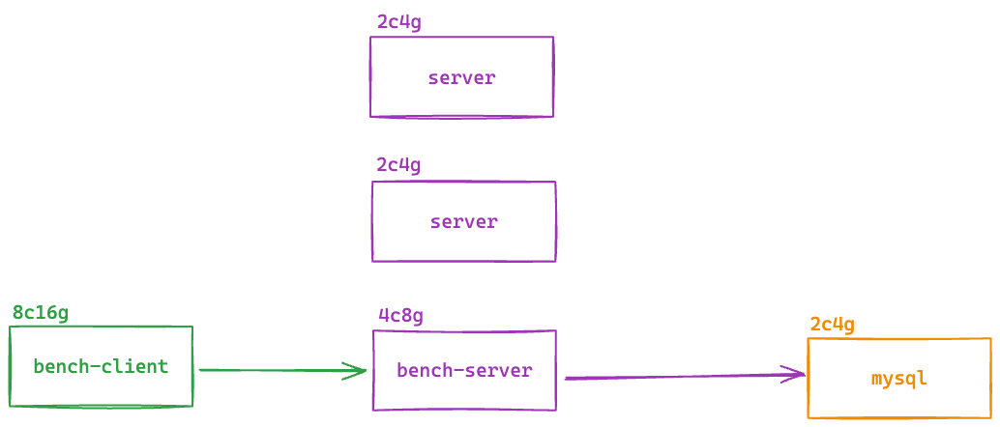

# 时序数据存储系统性能优化综合题

## 项目背景

你加入了一家全球工业物联网公司，负责优化其时序数据存储系统。该系统需要处理来自全球3000个工厂的实时传感器数据：

- 每个工厂有 20-50 种不同类型的传感器，每个工厂的负载和数据量不同
- 采用 push 模式：传感器通过 HTTP POST 将数据推送到存储系统

## 业务约束条件

1. **可靠性要求**：系统对失败率有上限要求（≤ 0.1%），数据不能丢失，系统崩溃后必须能够恢复
2. **性能要求**：QPS>10000、P99 <100ms、错误率<5%，数据持久化延迟<1s，数据丢失率<1%
3. **成本控制**：硬件预算有限，不能通过升级硬件解决

## 服务环境介绍


### 硬件环境配置
1. 一台 2c4g 的服务器用于部署 Mysql；
2. 一台 4c8g 的服务器用于部署 bench-server；
3. 两台 2c4g 的服务器备用，可以随意使用；
4. 一台 8c16g 的服务器用于做压测 bench-client；

### 软件环境
- **操作系统**: Linux Rocky
- **编程语言**: Go 1.21+
- **数据库**: MySQL 8.0+
- **压测工具**: bench-client

### 当前系统架构
- **HTTP服务器**: 基于Go语言的HTTP API服务
- **数据存储**: MySQL数据库，包含时序数据表和设备状态表
- **数据传输**: JSON格式的HTTP POST请求
- **负载均衡**: 单实例部署（需要优化）

### 当前性能指标(测试得出)
| API  | 并发 | QPS  | P99 时延 | 失败率 | CPU  | 内存 | I/O  |
| ---- | ---- | ---- | -------- | ------ | ---- | ---- | ---- |
|      | 1000 |      |          |        |      |      |      |
|      |      |      |          |        |      |      |      |
|      |      |      |          |        |      |      |      |
|      |      |      |          |        |      |      |      |
|      |      |      |          |        |      |      |      |
|      |      |      |          |        |      |      |      |
|      |      |      |          |        |      |      |      |


### 数据特征分析

- **平均记录大小**: 约85字节（基础数据）+ 可变负载数据（512B-20KB）
- **时间戳重复率**: 60%（多个传感器同时采样）
- **设备ID模式**: 每个工厂的设备ID具有相同前缀
- **数值精度**: 大部分传感器只需要2位小数精度
- **数据到达模式**: 存在明显的时间聚集性

```golang
// SensorData 表示传感器数据结构
type SensorData struct {
	Timestamp  string  `json:"timestamp"`
	DeviceID   string  `json:"device_id"`
	MetricName string  `json:"metric_name"`
	Value      float64 `json:"value"`
	Priority   int     `json:"priority"` // 1:高 2:中 3:低
	Data       string  `json:"data"`     // 随机负载数据，用于增大传输量
}
```


## 系统API接口

### 核心API端点
- `POST /api/sensor-rw` - 传感器数据读写操作（带事务）
- `POST /api/batch-sensor-rw` - 批量传感器数据读写操作
- `GET /api/get-sensor-data` - 传感器时序数据查询

### 数据结构
- **传感器数据**: 包含时间戳、设备ID、指标名称、数值、优先级、负载数据
- **设备状态**: 设备最新值、更新时间、告警计数
- **业务逻辑**: 数值>100触发高优先级告警，更新设备状态

## 第一部分：系统环境搭建与基准测试（20分）

### 任务1: 环境搭建
1. **数据库初始化**
   - 安装并启动MySQL数据库
   - 执行初始化SQL脚本创建表结构
   - 插入测试数据验证数据库连接

2. **服务器启动**
   - 编译并启动Go HTTP服务器
   - 验证所有API端点正常工作
   - 检查服务器日志和健康状态

3. **压测工具配置**
   - 使用提供的压测工具，进行基准测试

### 任务2: 基准性能测试（提供性能测试报告模版）
1. **基线测试**

   - 使用不同并发数（100, 500, 1000, 2000 或更高）进行压测
   - 测试每个API端点的基础性能
   - 记录QPS、响应时间分布、错误率，分析不同数据负载大小对性能的影响
   - 监控CPU、内存、磁盘I/O、网络I/O使用情况，分析各组件的资源消耗模式
   - 记录系统在各并发级别下的表现
   - 识别系统性能拐点和瓶颈

   | API  | 并发 | QPS  | P99 时延 | 失败率 | CPU  | 内存 | 磁盘 I/O | 网络 I/O |
   | ---- | ---- | ---- | -------- | ------ | ---- | ---- | -------- | -------- |
   |      |      |      |          |        |      |      |          |          |
   |      |      |      |          |        |      |      |          |          |
   |      |      |      |          |        |      |      |          |          |
   |      |      |      |          |        |      |      |          |          |
   |      |      |      |          |        |      |      |          |          |
   |      |      |      |          |        |      |      |          |          |
   |      |      |      |          |        |      |      |          |          |

## 第二部分：性能优化

### 任务1: 程序优化

bench-server 的代码已经提供，你可以对代码进行优化以提高各个 API 的性能，要遵守以下几个条件：

1. 原有业务逻辑不能丢失；（固定验证函数）
2. 表结构不能发生变化；

### 任务2: 架构优化

根据当前提供的服务器资源，你可以使用任何中间件对当前架构进行优化，有以下几个条件：

1. 测试过程中程序需要重启一次；


## 性能目标与评估标准

### 核心性能指标（必须达到）
- **QPS**: 目标 ≥ 10,000 requests/second
- **P99延迟**: 目标 ≤ 500ms
- **失败率**: 目标 ≤ 1%
- **持久化延迟**：目标 ≤ 1s
- **数据丢失率**：目标 ≤ 0.5%


### 资源利用率（根据使用情况酌情加分）

- **CPU利用率**:
- **内存使用**
- **SSD写入带宽利用率**: 目标 ≥ 30%
- **网络带宽利用率**: 目标 ≥ 50%
- **数据库连接池利用率**: 目标 60-80%


## 预计答题时间

120-180分钟

## 难度等级

高级

---

**注意事项**：

- 请确保所有优化方案都考虑了业务约束条件
- 性能测试结果需要具有可重现性
- 代码实现需要考虑错误处理和边界情况
- 优化方案需要平衡性能、可靠性和成本
- 提供的解决方案应该具有生产环境可用性